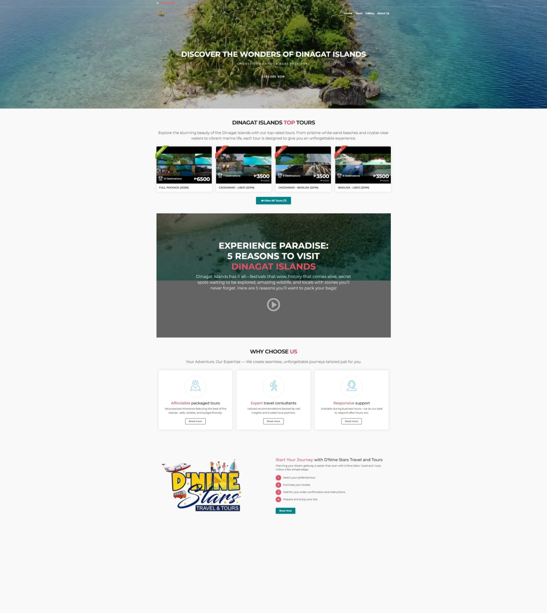

# D’Nine Stars Travel and Tours Website  
🌐 [Live Site](https://dninestarstravelandtours.com)

A professionally designed and responsive website built for **D’Nine Stars Travel and Tours**, a travel agency based in Dinagat Islands.  
The site enhances the company’s **online presence** and enables customers to explore travel packages, view destinations, and **book tours directly through an integrated email booking system**.

---

## ✨ Features
- 📱 **Responsive Design** — Built with Bootstrap for a seamless experience on all devices  
- 🧭 **Dynamic Tour Listings** — Displays destinations, packages, and travel information clearly  
- 📩 **Email Booking System (PHP)** — Handles user inquiries and reservations via email  
- 💬 **Contact Form Integration** — Sends customer messages directly to the agency’s inbox  
- ⚡ **Optimized Performance** — Lightweight design for fast page loading and easy navigation  

---

## 🧩 Tech Stack
- **Frontend:** HTML, CSS, JavaScript, [Bootstrap]
- **Backend:** PHP (Form handling and email booking)  
- **Email Integration:** PHP `mail()` / SMTP (for booking and contact forms)  
- **Hosting:** cPanel / Apache Server  
- **Design Tools:** Figma (for layout and UI design)

---

## 📧 Email Booking Feature
The website includes a built-in **email booking and inquiry system** powered by PHP.  
Customers can fill out a form to request bookings or travel quotes, and the system automatically sends the details to the agency’s email.

**Workflow Example:**
1. User fills out the booking form (name, destination, date, contact info).  
2. PHP validates and sanitizes input data.  
3. PHP’s `mail()` or SMTP sends a formatted email to the agency’s address.  
4. User receives an on-page confirmation message.

This ensures a direct and efficient communication channel between customers and the travel agency.

---

## 🧠 My Role
- Designed and implemented the website layout using Bootstrap  
- Developed responsive and mobile-friendly pages  
- Integrated **PHP-based email booking and contact form system**  
- Deployed and maintained the live version of the site  

---

## 📍 About
This website was developed as a **freelance project** for **D’Nine Stars Travel and Tours** (Dinagat Islands, Philippines).  
It demonstrates the use of **PHP and Bootstrap** to create a professional, functional, and user-focused business website.

---

## 📸 Preview 

---

## 🧾 License
This project is proprietary and the **source code is private**.  
For demonstration purposes, only the website and visual assets are shared.

---

**Developed by:**  
**Brylle Joshua Logroño**
